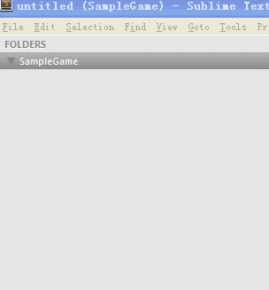
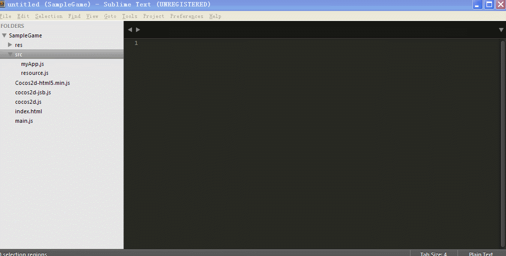
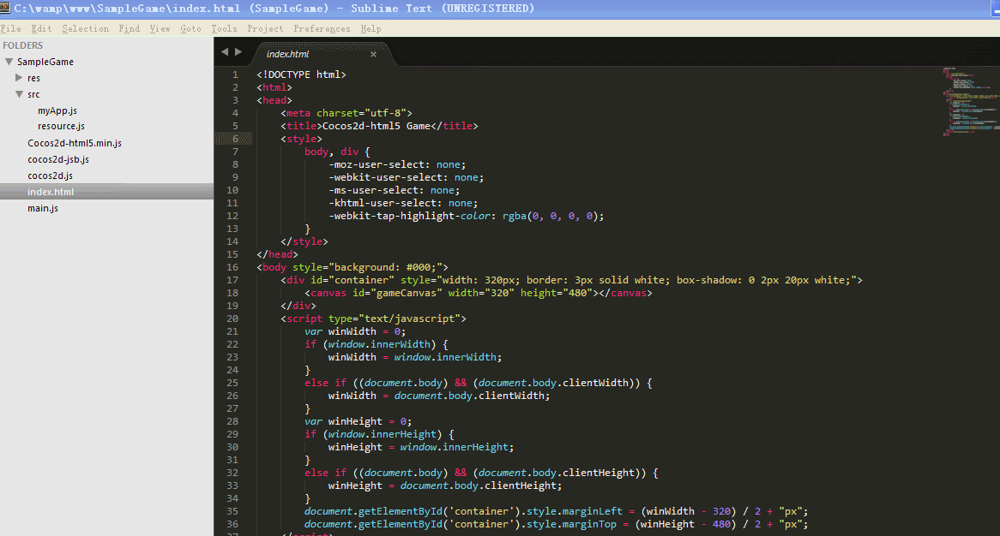
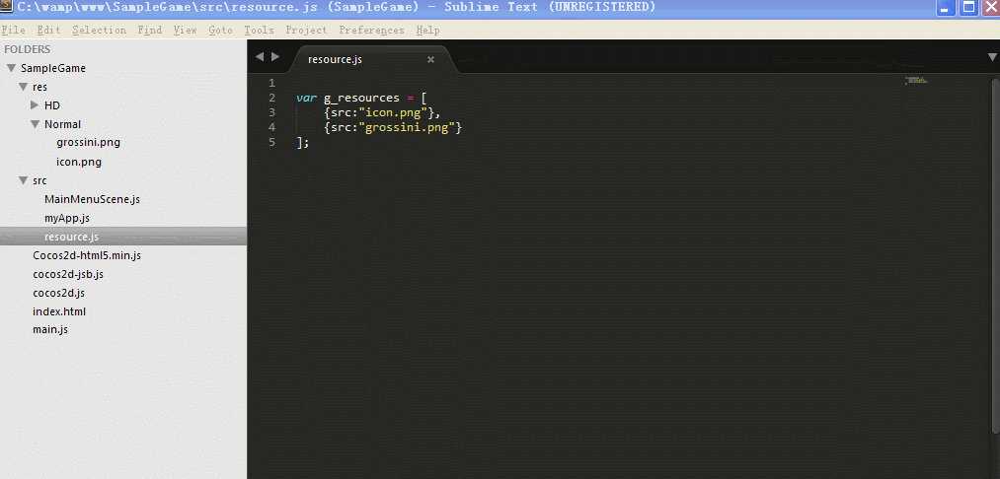
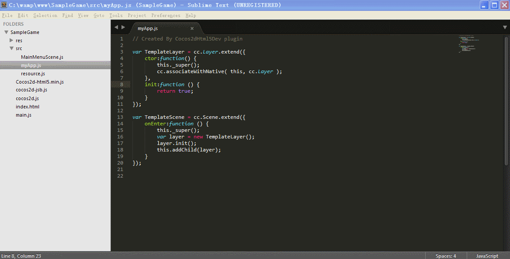
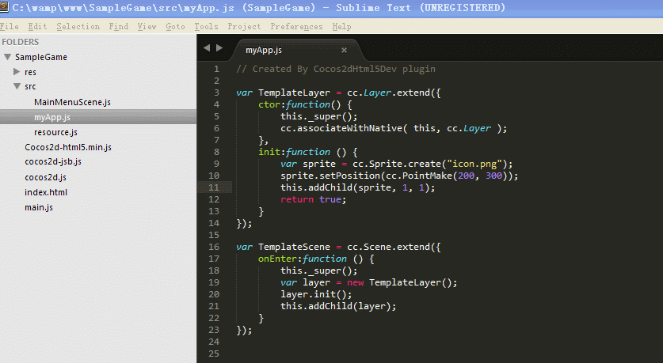
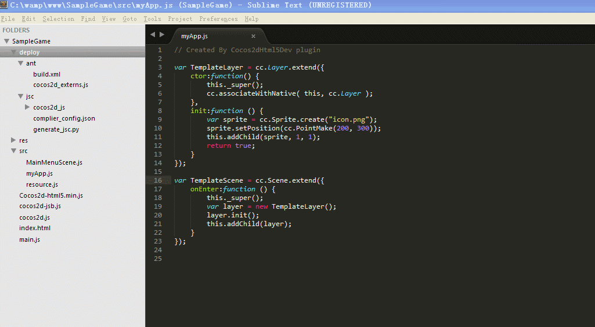
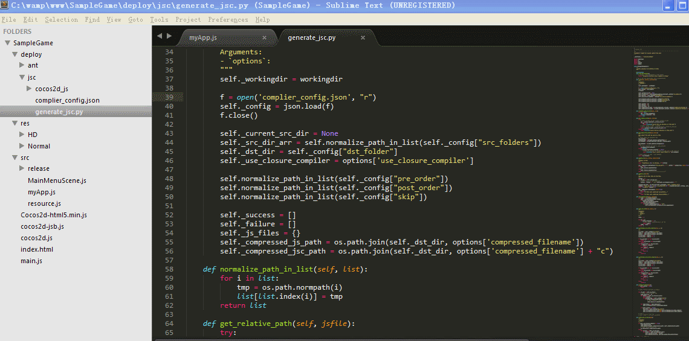
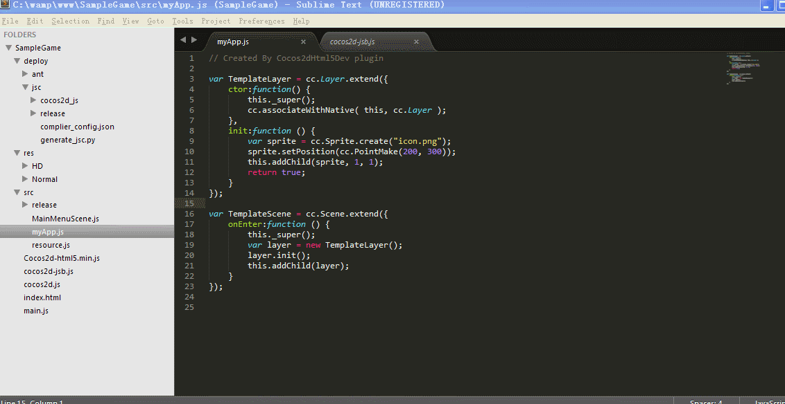

### Sublime Cocos2d HTML5 plugin

A `Cocos2d-HTML5 v2.x` plugin for `Sublime Text` with the following features:

- Create Project
- New JS file from template
    – CCScene
    – CCLayer
    – CCScene + CCLayer
- Run project in browser
- Update Resources List
- Code auto completion
- Create deploy folder
– Create ant folder for packing project
– Create `jsc` for compiling `js` to `jsc`
- Code Snippets (In progress)
- Run ant command
- Run `jsc` compile command
- Go to definition

Note:

There is a [post](http://www.supersuraccoon-cocos2d.com/2014/04/11/cocos2dhtml5dev-a-cocos2d-html52-x-plugin-for-sublimetext/) on my blog talking about this demo.